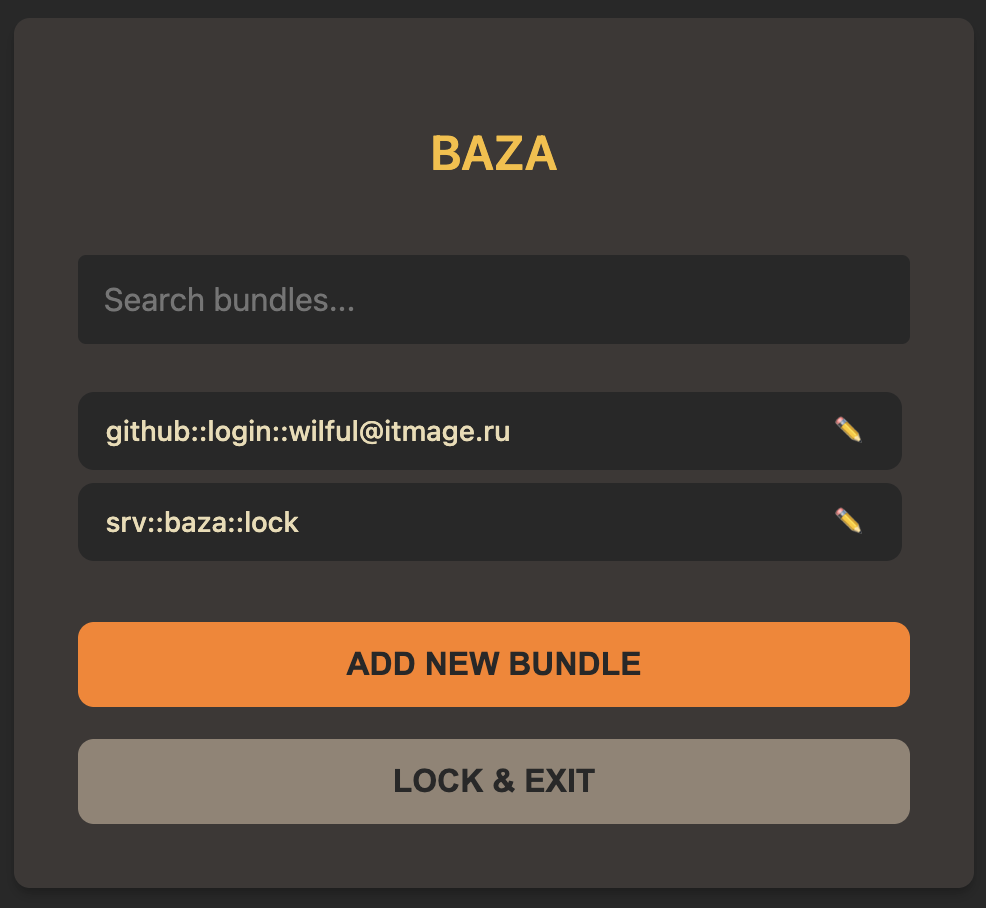

# baza


[](https://github.com/itmagelab/baza/actions/workflows/docker.yaml)


## Description

This project is created as an alternative to password-store, but written in a low-level language with additional features

## Why should I use baza?

* Because it's very blazzing fast

## Web Interface



Baza also provides a web interface for managing your passwords. The web interface is available at [https://0ae.ru](https://0ae.ru).

The database is stored locally in the user's browser and is not transmitted anywhere. You can create an unlimited number of bundles with passwords, and all of them can be unlocked with different passwords. The database can also be dumped to your cloud storage and then deployed in another location to continue working.

## Installation

#### Docker ([ghcr.io](https://github.com/itmagelab/baza/pkgs/container/baza))

    docker run -ti -v "${HOME}/.baza:/usr/share/baza/.baza:rw" ghcr.io/itmagelab/baza:release-v2.6.1 baza --help

#### Cargo ([crates.io](https://crates.io/crates/baza))

> [!WARNING]
> Minimum Supported Rust Version: 1.83

    cargo install baza

#### Building

Baza compiles with Rust 1.83.0 (stable) or newer.

    git clone https://github.com/itmagelab/baza
    cd baza
    cargo build --release
    ./target/release/baza --version
    cp ./target/release/baza ~/.cargo/bin/

## Usage

Generate a new key for baza

    baza init

This command will generate a password phrase automatically, can be used for automations and CIs

> [!WARNING]
> !!! This is not an idempotent operation !!!
>
> When you create a new key, the old one is deleted without warning and the data cannot be recovered if you forget the password phrase

#### Re-init your baza

    baza init -p my_secret_pass_phrase
    baza --help

#### Generate a new password by baza

    baza password generate --length 10
    baza password generate --length 30 --no-letters --no-symbols

#### Create your baza bundles

    baza bundle add full::path::for::login
    baza bundle add work::depart::ldap::username
    baza bundle add site::google::username@gmail.com

#### Delete your baza bundles

    baza bundle delete full::path::for::login

#### Edit your bundle

    baza bundle search login
    baza bundle edit full::path::for::login

#### Passphrase usage & Session caching

Baza does not store your passphrase on disk. You must provide it for each command, or cache it temporarily for your terminal session.

##### Option 1: Provide passphrase per command
Specify it via the `--passphrase` option or set the `BAZA_PASSPHRASE` environment variable:

    baza --passphrase my_secret bundle show site::google::username@gmail.com
    # OR
    export BAZA_PASSPHRASE=my_secret
    baza bundle show site::google::username@gmail.com

##### Option 2: Session caching (Unlock / Lock)
You can unlock your database for the current terminal session. The `baza unlock` command verifies your credentials and outputs an export command for `BAZA_PASSPHRASE`.

To unlock the session:

    eval $(baza unlock)

*(You will be prompted for your passphrase and TOTP code if enabled)*

To lock the session and clear the cached passphrase:

    eval $(baza lock)

#### Copy password to clipboard (first line from bundle)

    baza bundle copy full::path::for::login
    baza --copy full::path::for::login

#### Create bundle password from stdin

    echo '$ecRet' | baza --stdin full::path::for::login

#### TOTP Authentication

Baza supports Two-Factor Authentication (2FA) using Time-based One-time Passwords (TOTP).

##### Enable TOTP
To enable TOTP protection, run:

    baza totp enable --qr

This will generate a random secret key and display a QR code in your terminal. Scan this QR code with your authenticator app (such as Google Authenticator, Aegis, 2FAS, etc.). It will be registered under a randomly generated UUID representing this specific vault database.

##### Check Status
To check if TOTP is enabled:

    baza totp status

##### Disable TOTP
To disable TOTP protection:

    baza totp disable

##### Using TOTP to Unlock
Once enabled, Baza will require a valid TOTP code to unlock the database for any command:

1. **Interactive Prompt:** If you do not provide the code, Baza will display the database ID and prompt you:
   ```
   Error: TOTP code required (ID: a3b5...)
   Enter TOTP code:
   ```
2. **CLI Flag:** Provide the code via `-t` or `--totp`:
   ```
   baza --passphrase my_secret -t 123456 bundle show site::google::username@gmail.com
   ```
3. **Environment Variable:** Set the `BAZA_TOTP` variable:
   ```
    export BAZA_TOTP=123456
    baza bundle show site::google::username@gmail.com
    ```

## Configuration

By default, Baza looks for its configuration file at:
- **Release mode:** `~/.config/baza/baza.toml`
- **Debug mode:** `./.baza/baza.toml` (within the project folder)

You can override the configuration path using the `BAZA_CONFIG` environment variable:

    BAZA_CONFIG=/path/to/my/baza.toml baza list

## How to keep your keys safe

    gpg --list-keys
    echo "daec1759-f713-4cb2-bae6-5817b22c9c6c" | gpg --encrypt --armor --recipient root@itmage.ru > key.asc
    gpg --decrypt key.asc

Save the key in a safe place

## Create a GPG key

    gpg --gen-key
    gpg --export --armor baza > public_key.asc

## Generate VHS articles

    vhs < Baza.tape

## Migration from pass

    bash contrib/pass-to-baza.sh

## TODO

* Sync from a cloud providers
